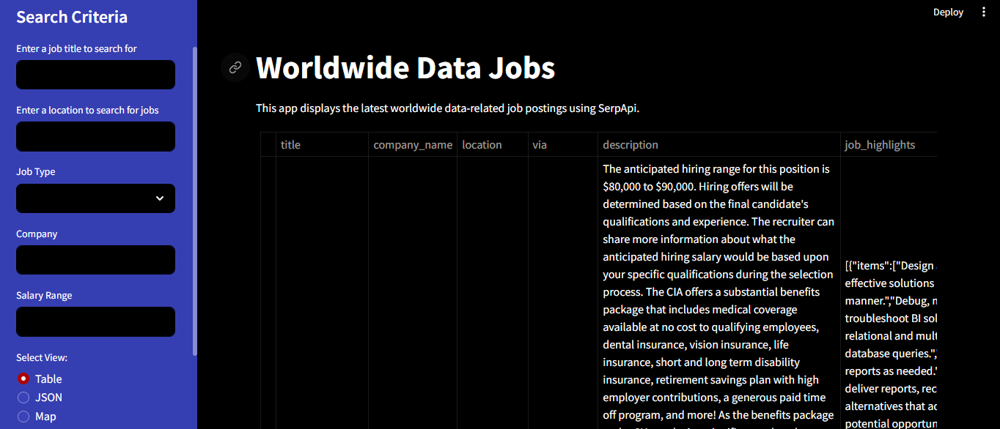

# JobSearcher App

## Overview

This Streamlit app displays the latest worldwide data-related job postings using the SerpApi to fetch real-time job data based on user-defined search criteria.



## Features

- Search for data-related jobs worldwide.
- View job listings in a table format.
- Download job listings as a CSV file.
- View job listings on a map (if location data is available).
- View job listings in JSON format.

## Installation

To run the JobSearcher app locally, follow these steps:

1. Clone this repository to your local machine:

```
git clone https://github.com/Mohammed-Mebarek-Mecheter/job-search-app.git
```

2. Install the required dependencies using pip:

```
pip install -r requirements.txt
```

3. Obtain an API key from the Google Jobs API and replace `API_KEY` in the code with your actual API key.

4. Run the Streamlit app:

```
streamlit run app.py
```

## Usage

- Upon running the app, users will be presented with a search interface.
- Enter desired job titles and search parameters, then click the "Search" button.
- The app will fetch job listings from the Google Jobs API based on the provided criteria.
- Users can view detailed information about each job listing and filter results as needed.
- To download search results, click on the "Download CSV" button.

## Contributing

Contributions to the JobSearcher app are welcome! If you have any suggestions, bug fixes, or feature requests, please open an issue or submit a pull request on GitHub.

## Author

- LinkedIn: [Let's connect](https://www.linkedin.com/in/mohammed-mecheter/)
- Portfolio: [Mebarek](https://mebarek.pages.dev/)
